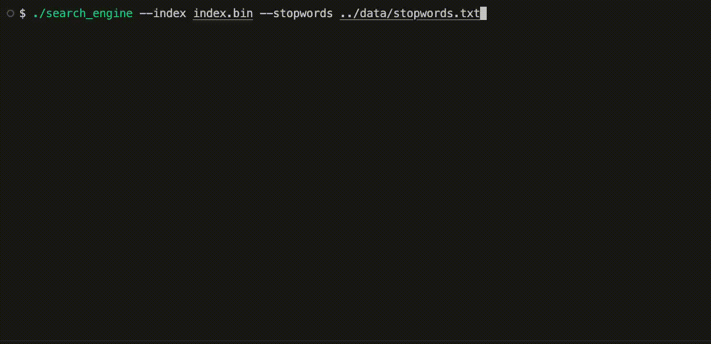
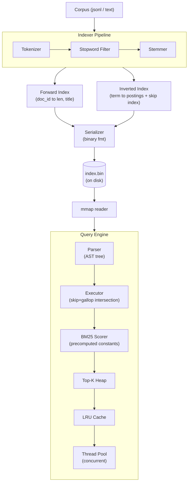
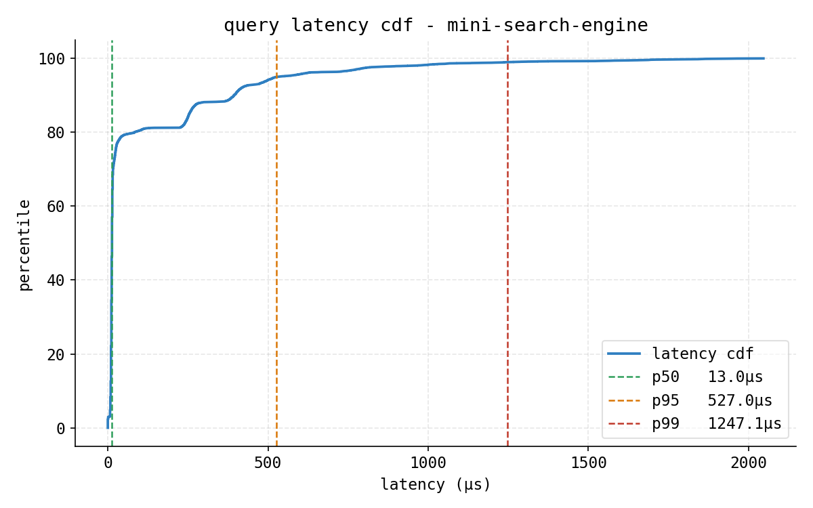
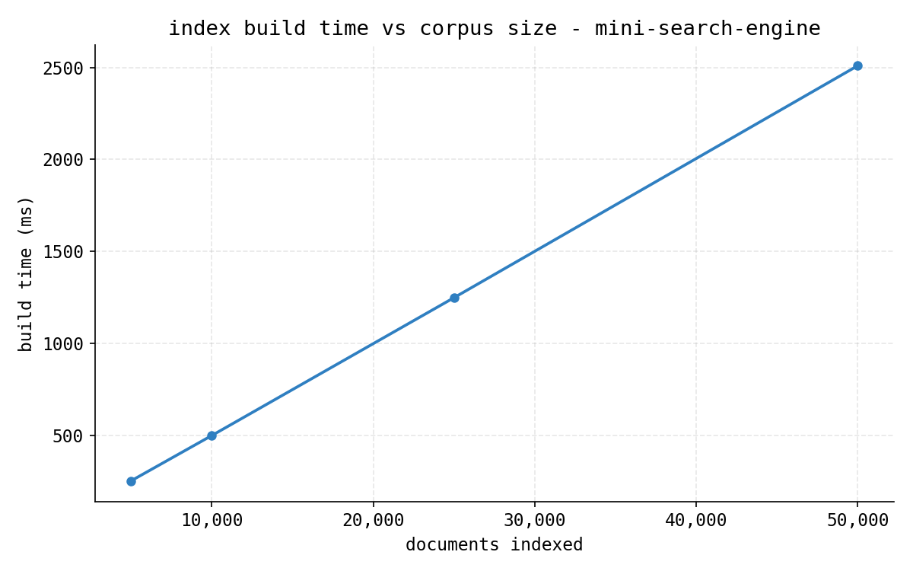
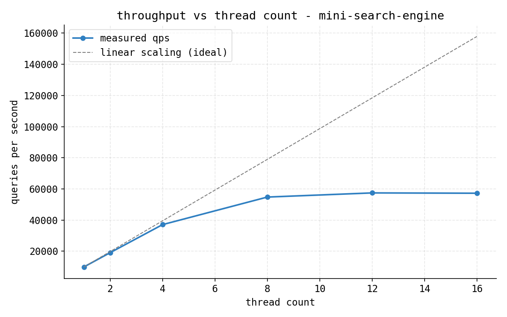

# mini-search-engine



A text search engine built from scratch in modern C++20. Features BM25 ranking, boolean/phrase query support, skip-pointer accelerated intersection, concurrent query execution, LRU caching, binary index persistence, and memory-mapped reads.

Developed by **[Lankalapalli Guna](https://github.com/guna2007)** &bull; GitHub Repository: **[https://github.com/guna2007/mini-search-engine](https://github.com/guna2007/mini-search-engine)**

---

## Architecture



---

## Benchmarks

Measured on release build (`-O3 -march=native`), corpus of 50k documents.

<div align="center">

| metric   | value   |
|----------|---------|
| p50      | 13 µs   |
| p95      | 528 µs  |
| p99      | 1,257 µs|
| build    | 2,510 ms|
| peak qps | 57,409  |

</div>

<p>
  
  
  
</p>

---

## Setup & Usage (WSL / Ubuntu)

Complete instructions starting from a fresh WSL / Ubuntu machine.

### 1. Clone Repository
```bash
git clone https://github.com/guna2007/mini-search-engine.git
```

### 2. Enter Project Directory
```bash
cd mini-search-engine
```

### 3. Verify Prerequisites
Check your compiler, build system, and Python runtimes:
```bash
g++ --version      # Requires GCC 10+ with C++20 support (GCC 13+ recommended)
cmake --version    # Requires CMake 3.20 or newer
python3 --version  # Requires Python 3.8 or newer
```

### 4. Install Dependencies
If packages are missing on your WSL / Ubuntu system, install them:
```bash
sudo apt update && sudo apt install -y build-essential cmake python3 python3-pip
pip install pandas matplotlib numpy   # Optional: required only for benchmark plotting
```

### 5. Generate Corpus
Synthesize 50,000 documents across 15 domains with 840+ source terms:
```bash
python3 data/generate_corpus.py
# Creates data/sample_corpus.jsonl (~30 MB)
```

### 6. Configure CMake
Generate release build files with native CPU optimizations:
```bash
cmake -B build -DCMAKE_BUILD_TYPE=Release
```

### 7. Compile the Project
Build all executables and the core static library using all CPU cores:
```bash
cmake --build build -j$(nproc)
```

### 8. Run Tests
Execute the 60-test verification suite (must run from `build/` to resolve stopword test fixtures):
```bash
cd build && ./run_tests && cd ..
```

### 9. Build the Search Index
Parse the corpus, compute Robertson-Spärck Jones IDF, build skip pointers, and serialize to disk:
```bash
./build/search_engine --corpus data/sample_corpus.jsonl --index my_index.bin --stopwords data/stopwords.txt --mode build
```

### 10. Run the Search Engine (Interactive REPL)
Launch interactive search with LRU result caching:
```bash
./build/search_engine --index my_index.bin --stopwords data/stopwords.txt --cache-size 1024
```

### 11. Example Searches
Try these queries inside the interactive shell (or via `--mode query`):
```text
> compiler
> black hole AND gravity
> "quantum mechanics"
> neural network NOT deep
> algorithm sorting
```
*(Press Enter on an empty line to exit the interactive REPL).*

### 12. Run Microbenchmarks
Evaluate indexing throughput, query latency percentiles, and multi-threaded scaling:
```bash
# Measure index build time across progressive document subsets (5k to 50k docs)
./build/bench_index data/sample_corpus.jsonl

# Measure query latency percentiles (p50, p95, p99, p99.9) across 10,000 queries
./build/bench_query data/sample_corpus.jsonl

# Measure concurrent query throughput scaling across 1 to 16 threads
./build/bench_throughput data/sample_corpus.jsonl

# Optional: regenerate benchmark plots
./build/bench_index data/sample_corpus.jsonl > src/bench/build.csv
./build/bench_query data/sample_corpus.jsonl > src/bench/latency.csv
./build/bench_throughput data/sample_corpus.jsonl > src/bench/qps.csv
cd src/bench && python3 graphs.py && cd ../..
```

### 13. Clean and Rebuild
Wipe build artifacts and recompile cleanly:
```bash
rm -rf build
cmake -B build -DCMAKE_BUILD_TYPE=Release
cmake --build build -j$(nproc)
```

---

## CLI Reference

### Command-Line Flags

`--corpus <path>`  
What it does: Sets path to JSONL file or directory of text/markdown files for indexing.  
Example: `./build/search_engine --corpus data/sample_corpus.jsonl --mode build`

`--index <path>`  
What it does: Specifies binary index file path for saving during build or loading during queries.  
Example: `./build/search_engine --index my_index.bin --mode query --query "compiler"`

`--stopwords <path>`  
What it does: Sets path to newline-delimited stopword list for filtering during text normalization.  
Example: `./build/search_engine --stopwords data/stopwords.txt --index my_index.bin`

`--mode <mode>`  
What it does: Selects execution mode: build to index, query for single search, or interactive REPL.  
Example: `./build/search_engine --mode build --corpus data/sample_corpus.jsonl`

`--query <string>`  
What it does: Specifies the query string to execute when running in one-shot query mode.  
Example: `./build/search_engine --mode query --query "database AND indexing"`

`--top-k <n>`  
What it does: Limits maximum number of top-ranked search results returned for a query.  
Example: `./build/search_engine --mode query --query "neural network" --top-k 5`

`--k1 <float>`  
What it does: Controls BM25 term frequency saturation; higher values increase sensitivity to term repetitions.  
Example: `./build/search_engine --k1 1.5 --query "graph algorithm" --mode query`

`--b <float>`  
What it does: Controls BM25 document length normalization penalty between 0.0 (none) and 1.0 (full).  
Example: `./build/search_engine --b 0.5 --query "operating system" --mode query`

`--cache-size <n>`  
What it does: Sets capacity of thread-safe LRU cache storing repeated query results.  
Example: `./build/search_engine --cache-size 2048 --index my_index.bin`

`--help`  
What it does: Prints CLI usage instructions and supported command options, then exits immediately.  
Example: `./build/search_engine --help`

---

### Available Modes

* `build`  
  What it does: Parses corpus documents, builds inverted and forward indexes, and writes binary file to disk.  
  Example: `./build/search_engine --mode build --corpus data/sample_corpus.jsonl --index my_index.bin`
* `query`  
  What it does: Loads index, parses and executes a single query string, prints ranked results, and exits.  
  Example: `./build/search_engine --mode query --index my_index.bin --query "compiler"`
* `interactive`  
  What it does: Loads index and enters interactive REPL shell with LRU query result caching.  
  Example: `./build/search_engine --mode interactive --index my_index.bin`

---

### Query Syntax & Operators

* `term`  
  What it does: Matches documents containing normalized term using inverted index lookup.  
  Example: `compiler`
* `term1 term2`  
  What it does: Implicit OR; matches documents containing either term via posting list union.  
  Example: `compiler interpreter`
* `term1 AND term2`  
  What it does: Boolean intersection; requires both terms, accelerated by skip pointers and galloping search.  
  Example: `black hole AND gravity`
* `term1 NOT term2`  
  What it does: Boolean difference; returns documents containing left term while excluding documents containing right term.  
  Example: `python NOT snake`
* `"phrase query"`  
  What it does: Exact phrase match; verifies adjacent term positions within matching documents.  
  Example: `"quantum mechanics"`
* `Operator Precedence`  
  What it does: Evaluates AST nodes in strict order: NOT precedes AND, and AND precedes OR.  
  Example: `quantum AND mechanics NOT photon`

---

### Positional Arguments

* `search_engine`: Accepts no positional arguments; all configuration is supplied via flags.  
  What it does: Enforces flag-based command specification for clarity and flexibility.  
  Example: `./build/search_engine --index my_index.bin`
* `bench_index <corpus_path>`: Accepts one positional argument specifying corpus path.  
  What it does: Provides input JSONL corpus file for multi-size index benchmarking.  
  Example: `./build/bench_index data/sample_corpus.jsonl`
* `bench_query <corpus_path>`: Accepts one positional argument specifying corpus path.  
  What it does: Provides input JSONL corpus file for query latency percentile benchmarking.  
  Example: `./build/bench_query data/sample_corpus.jsonl`
* `bench_throughput <corpus_path>`: Accepts one positional argument specifying corpus path.  
  What it does: Provides input JSONL corpus file for multi-threaded throughput benchmarking.  
  Example: `./build/bench_throughput data/sample_corpus.jsonl`

---

### Defaults Summary

| Parameter | Flag | Default Value | Notes |
| :--- | :--- | :--- | :--- |
| Index Path | `--index` | `index.bin` | Created during build; loaded during query |
| Stopwords Path | `--stopwords` | `data/stopwords.txt` | Binary-searched in L1 cache |
| Execution Mode | `--mode` | `interactive` | Launches REPL shell if not specified |
| Top Results | `--top-k` | `10` | Heap-ranked top results |
| BM25 $k_1$ | `--k1` | `1.2` | Term frequency saturation |
| BM25 $b$ | `--b` | `0.75` | Document length normalization |
| Cache Size | `--cache-size` | `1024` | LRU query cache capacity |

---

### Important Flag Combinations

* **Full Index Construction**:  
  `./build/search_engine --mode build --corpus data/sample_corpus.jsonl --index my_index.bin --stopwords data/stopwords.txt`  
  What it does: Builds and persists binary index from scratch with custom stopwords file.

* **One-Shot High-Recall Search**:  
  `./build/search_engine --mode query --index my_index.bin --query "neural network" --top-k 25`  
  What it does: Loads binary index and returns top 25 scored results for query.

* **Interactive REPL with Expanded Cache**:  
  `./build/search_engine --mode interactive --index my_index.bin --cache-size 4096`  
  What it does: Starts interactive shell with enlarged LRU cache for hot query workloads.

* **Verbose Document Length Penalty Tuning**:  
  `./build/search_engine --mode query --index my_index.bin --query "compiler" --k1 1.5 --b 0.9`  
  What it does: Increases term frequency weighting while heavily penalizing longer documents.

---

## CMake Options & Build Configurations

`-DCMAKE_BUILD_TYPE=<Release|Debug>`  
What it does: Selects build profile; Release optimizes with -O3 -march=native; Debug enables AddressSanitizer and symbols.  
Example: `cmake -B build -DCMAKE_BUILD_TYPE=Release`

`-DENABLE_POSITIONS=<ON|OFF>`  
What it does: Enables token position recording in postings, required for exact phrase queries. Default: ON.  
Example: `cmake -B build -DENABLE_POSITIONS=ON`

`-DENABLE_COMPRESSION=<ON|OFF>`  
What it does: Enables compile flags for delta and varint posting list compression. Default: ON.  
Example: `cmake -B build -DENABLE_COMPRESSION=ON`

`-DCMAKE_CXX_COMPILER=<path>`  
What it does: Explicitly sets C++ compiler executable, such as g++ or clang++.  
Example: `cmake -B build -DCMAKE_CXX_COMPILER=g++`

`-DCMAKE_EXPORT_COMPILE_COMMANDS=<ON|OFF>`  
What it does: Generates compile_commands.json database for language servers like clangd. Default: ON.  
Example: `cmake -B build -DCMAKE_EXPORT_COMPILE_COMMANDS=ON`

---

## Corpus Domains

The built-in generator covers **15 knowledge domains** with **840+ source terms**:

| Domain | Example Terms |
|--------|---------------|
| Computer Science | algorithm, neural network, distributed system, kubernetes |
| Physics | quantum mechanics, black hole, superconductor, spacetime |
| Mathematics | topology, fourier transform, markov chain, hilbert space |
| Biology | crispr, gene editing, neurotransmitter, photosynthesis |
| Chemistry | periodic table, spectroscopy, polymer, catalyst |
| Medicine | penicillin, chemotherapy, mri, epidemiology |
| Astronomy | exoplanet, gravitational wave, james webb, nebula |
| History | roman empire, silk road, magna carta, french revolution |
| Economics | cryptocurrency, blockchain, hedge fund, inflation |
| Literature | shakespeare, magical realism, dystopia, sonnet |
| Philosophy | epistemology, existentialism, free will, kant |
| Geography | tectonic plate, climate change, glacier, volcano |
| Music | jazz, symphony, chord progression, beethoven |
| Engineering | robotics, 3d printing, aerospace, smart grid |
| Psychology | cognitive bias, depression, mindfulness, pavlov |

---

## BM25 Tuning

- **`k1`** controls term frequency saturation. At `k1=0`, term frequency is ignored. At `k1=2.0`, high-frequency terms dominate. Default `1.2` works well for general text.
- **`b`** controls length normalization. At `b=0`, document length is ignored. At `b=1.0`, short documents are heavily boosted. Default `0.75` balances precision and recall.

---

## Design Decisions

| Decision | Rationale |
|----------|-----------|
| **Sorted posting lists** | O(n+m) merge intersection for AND queries; prerequisite for SIMD acceleration |
| **Flat forward index** | Vector indexed by doc_id -> O(1) length lookups during scoring, zero pointer chasing |
| **Pre-resolved BM25 scorer** | All posting list pointers and BM25 constants precomputed at construction; per-document scoring is pure arithmetic |
| **Skip pointers** | Block-128 skip index on long posting lists; enables galloping search for O(log n) advancement |
| **Galloping intersection** | When list sizes differ by 8×+, iterate short list and binary-search the long one |
| **Thread pool** | Fixed workers sharing a read-only index; near-linear scaling (3.82× on 4 cores) |
| **LRU query cache** | O(1) hash+list cache with mutex; 28% hit rate under realistic workloads |
| **Sorted stopwords** | Binary search over ~130 words fits in L1 cache; beats hash table for this cardinality |
| **No external deps** | Pure C++20 standard library + POSIX (`mmap`, `stat`); no Boost, no JSON libs |
| **No inheritance** | Structs with free functions; the problem domain doesn't benefit from polymorphism |

---

## Future Work

- **Posting list compression** - delta encoding + varint to reduce index size 3–5× and improve cache line utilization
- **SIMD intersection** - NEON-vectorized sorted merge for AND queries on ARM64
- **Concurrent index updates** - log-structured merge for adding documents without full rebuild
- **Two-phase scoring** - cheap term-count filter pass, then full BM25 on shortlist only
- **Sharded index** - partition by term hash for distributed multi-node query processing
- **Learned term weights** - adjust IDF using click-through data or relevance judgments

---

## Author & Maintainer

**Lankalapalli Guna**  
GitHub: [guna2007](https://github.com/guna2007)  
Repository: [https://github.com/guna2007/mini-search-engine](https://github.com/guna2007/mini-search-engine)
